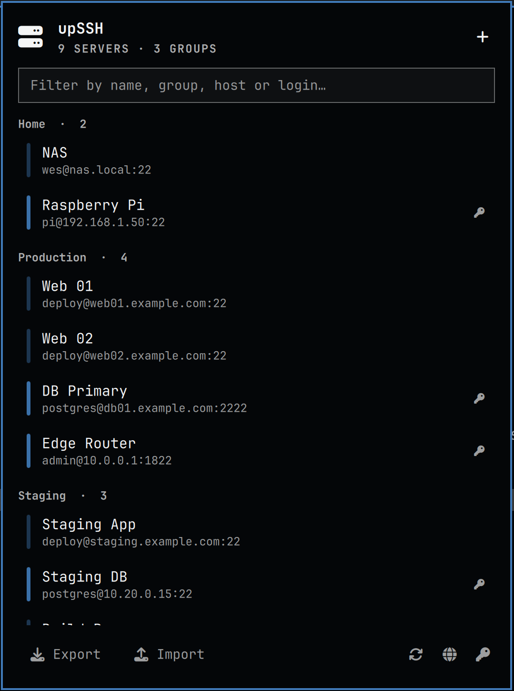

# upSSH

SSH access manager for [Omarchy](https://omarchy.org/). Your servers organised
in groups, reachable from the bar, the Omarchy menu or a terminal UI — with
passwords kept in a GPG-encrypted vault instead of a shell script's comments.

Available in **English** and **Portuguese**.



> The servers above are fictional. `docs/demo-servers.json` holds them, so
> screenshots never carry real hosts.

## What it does

- **Groups** — organise servers however you work: internal, external, customers.
- **Key or password login** — passwords live in an AES-256 GPG vault unlocked by
  one master password, cached by `gpg-agent` so you type it once per session.
  They reach `ssh` through an environment variable scoped to that one command,
  never through `argv`, so they never show up in `ps`.
- **First connection** shows you the host key fingerprint and asks before
  saving it to `known_hosts`, instead of failing silently under `sshpass`.
- **Three ways in** — a bar widget with a searchable panel, the Omarchy menu
  (`Super`, then type `ssh`), or `upssh` in a terminal.
- **Import / export** — plain JSON to share a server list, or an encrypted
  `.gpg` bundle (with passwords) to move to another machine. An imported file
  is treated as untrusted: every field is validated, ids are regenerated when
  malformed, and only ssh options that cannot run commands are kept (see
  [Importing files from someone else](#importing-files-from-someone-else)).

## Install

From the Omarchy plugin manager:

```bash
omarchy plugin add https://github.com/wegnix/upssh.git --enable
~/.config/omarchy/plugins/io.github.wegnix.upssh/bin/upssh link
```

The second line puts `upssh` on your `PATH` so the terminal UI works too. The
bar widget and the Omarchy menu work without it — they call the copy that ships
inside the plugin folder, by absolute path.

If `~/.local/bin/upssh` already exists and was not installed by upSSH, nothing
is overwritten: `link` refuses and offers `--name`, the installer says so and
carries on, and the uninstaller leaves that file alone.

Or clone and run the installer, which does both in one step:

```bash
git clone https://github.com/wegnix/upssh.git
cd upssh
./install.sh
```

Re-running the installer upgrades in place and never touches your servers or
vault. If the plugin folder is a git clone made by `omarchy plugin add`, the
installer stops and points you to `omarchy plugin update` instead of copying
files over the clone.

**Required:** `bash`, `jq`, `gum`, `openssh`, `gnupg`, `python3`, `flock`, `column` — all already present on a stock Omarchy.
**Optional:** `sshpass` for password logins, `zenity` for the panel's file dialogs.

```bash
sudo pacman -S --needed sshpass zenity
```

## Use

| Where | How |
|---|---|
| Bar | Click the upSSH icon · right click syncs the menu |
| Menu | `Super`, then `ssh` |
| Terminal | `upssh` |

```
upssh                       Terminal UI: group → server → connect
upssh connect <id>          Connect straight to a server
upssh add | edit | remove   Manage servers
upssh passwd                Set or change a server password
upssh export [--with-passwords] [--overwrite] [file]
upssh import <file> [--on-conflict replace|keep|copy|ask] [--dry-run]
upssh lang [pt|en]          Show or change the language
upssh master                Change the vault master password
```

## Where things live

```
~/.local/bin/upssh                                command
~/.config/omarchy/plugins/io.github.wegnix.upssh  bar widget + bundled command
~/.config/upssh/servers.json                      servers, no passwords
~/.config/upssh/secrets.gpg                       passwords, AES-256
~/.config/upssh/config.json                       preferences (language)
~/.config/upssh/.lock                             serialises writes (panel vs. terminal)
```

Everything upSSH creates is private to you (`umask 077`, the folder is mode 700).

Files outside those folders that upSSH writes:

- **`~/.config/omarchy/extensions/omarchy-menu.jsonc`** — the menu entries live in
  a block between `// >>> upssh` and `// <<< upssh`. The block is rewritten on
  every change, so don't edit it by hand. Everything outside it is preserved:
  the new file is only written if Omarchy can still parse it and every entry of
  yours is still there; otherwise the file is left unchanged and you get an
  error. It is replaced atomically with its original mode, and a symlink (e.g.
  to your dotfiles) is followed and kept. If a block marker is missing, nothing
  is touched. The file is created only when it does not exist.
- **`~/.ssh/known_hosts`** — on the first connection to a host, after you
  confirm the fingerprint.
- **Your private key** — if it lives under `~/.ssh`, is yours and is readable by
  others, it is set to `600` before connecting (synced folders often reset it).
  A key elsewhere is never changed; you only get a warning.
- **Export files** — only where you ask, never over an existing file unless you
  pass `--overwrite` (the panel does that only after the file dialog's own
  overwrite confirmation).

## About the vault

`secrets.gpg` is a symmetrically encrypted OpenPGP file: AES-256, salted and
iterated s2k, SHA-512. The master password is **not stored anywhere** — lose it
and the server passwords are gone, which is the point.

Reads go through `gpg-agent`, so the master password lives in the agent's
locked memory (never swapped) rather than in this script. Set the cache
lifetime in `~/.gnupg/gpg-agent.conf`:

```
default-cache-ttl 3600
max-cache-ttl 28800
```

Passwords never appear in a process command line: the panel hands them to
`upssh` over stdin, and `upssh` passes them on to `gpg`, `jq` and `sshpass`
through file descriptors or the environment of that one process.

The vault protects your passwords at rest. It does not protect them from
someone at your unlocked session — no more than your SSH keys do.

When a server is deleted while the vault is locked, or an import points an
existing id at a different host, its old password is marked stale: it is never
sent, the id is never reused, and it is purged the next time the vault is
written.

## Importing files from someone else

An export is plain data, but it ends up in ssh command lines and in the Omarchy
menu, so `upssh import` treats it as untrusted:

- ids must match `^[a-z0-9][a-z0-9-]{0,63}$`, otherwise a new one is generated;
- host and user may not start with `-` or contain spaces or control characters,
  ports must be 1–65535, and control characters are stripped from every text
  field — invalid servers are skipped and reported;
- of the ssh options, only algorithm, keep-alive, timeout, compression and
  authentication-method settings are kept (`-o` with one of
  `HostKeyAlgorithms`, `PubkeyAcceptedAlgorithms`, `KexAlgorithms`, `Ciphers`,
  `MACs`, `ServerAliveInterval`, `ServerAliveCountMax`, `ConnectTimeout`,
  `ConnectionAttempts`, `Compression`, `TCPKeepAlive`, `IdentitiesOnly`,
  `PreferredAuthentications`, `PasswordAuthentication`,
  `PubkeyAuthentication`, `KbdInteractiveAuthentication`, `AddressFamily`,
  `LogLevel`, plus `-4`, `-6`, `-C`, `-q`, `-v`). Anything else — `ProxyCommand`,
  `LocalCommand`, `-A`, `StrictHostKeyChecking`… — is dropped with a warning;
- files over 1 MiB are refused;
- if the file carries passwords and the vault can't be unlocked, nothing is
  imported.

## Uninstall

```bash
./uninstall.sh
```

Removes the command (only if upSSH installed it), links made with
`upssh link --name`, the widget and the menu block (and the menu file itself if
nothing else is left in it). It asks separately before deleting your servers
and vault. Lines in `known_hosts` are left alone.

## License

MIT © Wesley Farias
